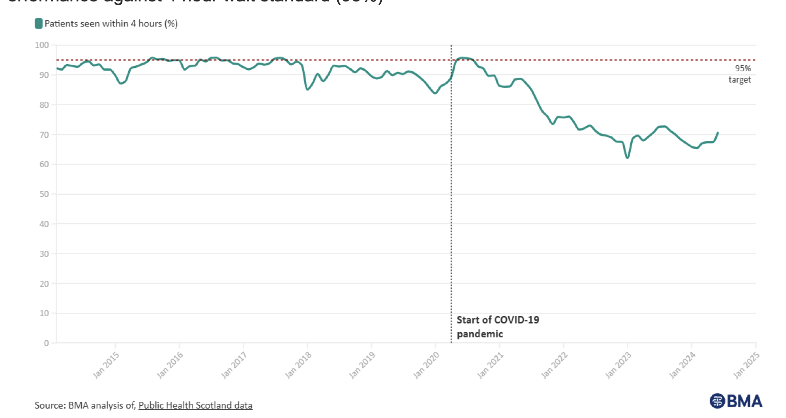

# NHS A&E Waiting Times Analysis (Scotland)

> Data analysis project exploring NHS A&E performance and the factors contributing to increased waiting times.

---

## 📊 Overview
This project analyses A&E (Accident & Emergency) waiting times in Scotland to understand the key factors driving delays in patient care.

The analysis focuses on system pressures such as rising patient demand, staffing shortages, and increasing GP workload, and explores how these challenges impact NHS performance.

---

## 🎯 Objectives
- Analyse trends in A&E waiting times  
- Identify key drivers of delays in emergency care  
- Evaluate healthcare system pressures  
- Propose data-driven solutions to improve performance  

---

## 🔍 Key Insight

### A&E Waiting Times Trend
Shows a clear decline in the percentage of patients seen within the 4-hour target, particularly following the COVID-19 pandemic, highlighting increasing pressure on NHS services.

---

## 💡 Proposed Solution
A **real-time patient feedback system** designed to:
- Capture patient experience during their A&E journey  
- Provide actionable insights for service improvement  
- Support data-driven decision-making in healthcare  
- Improve overall patient satisfaction and service quality  

---

## ⚠️ Considerations
- Data privacy and GDPR compliance  
- User adoption challenges  
- Implementation and operational costs  
- Staff engagement and training  

---

## 🛠 Tools & Skills
- Data Analysis  
- Data Visualisation  
- Research & Reporting  
- Healthcare Analytics  

---

## 📁 Files Included
- `report.pdf` — full project report  
- `images/waiting-times-trend.png` — key visualisation  

---

## 📌 Data Source
Publicly available NHS and healthcare performance data (Scotland)
